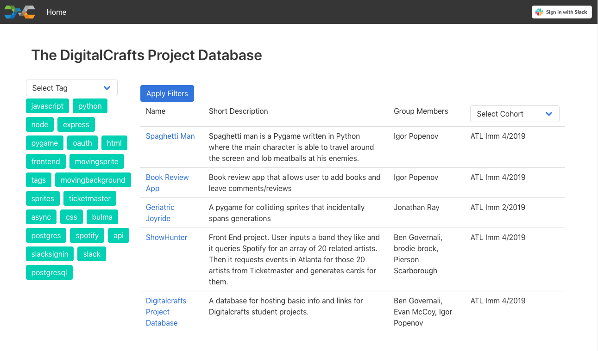
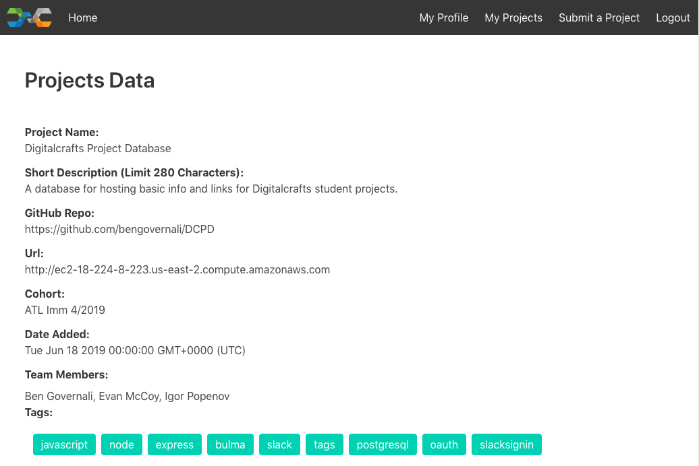
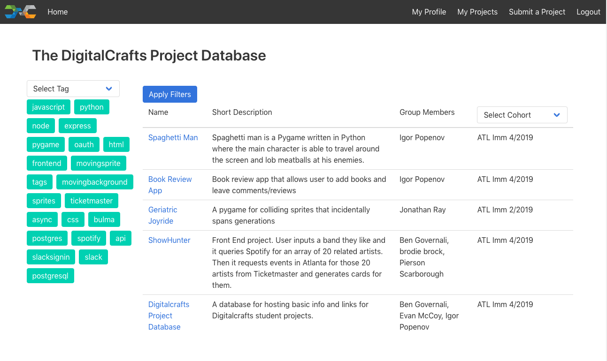
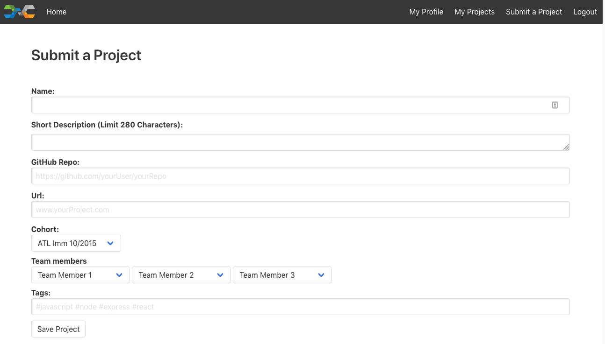
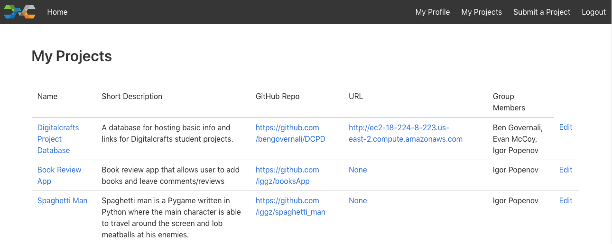

The DigitalCrafts Project Database (DCPD)
---
Live instance: http://ec2-18-224-8-223.us-east-2.compute.amazonaws.com/

The DigitalCrafts Project Database is a full-stack project created for DigitalCrafts and built with Node, Express, PostgreSQL, HTML, CSS, JavaScript, Bulma, and ES6 Renderer. It was built with a team of 3 people over the course of 3 days in class. We built the DCPD to be a solution to a problem that many bootcamp students have: finding inspiration (or help) when building projects. Any DigitalCrafts student or alumni can submit a project to the database (via Slack authentication), and the database is viewable to everyone. This was a backend database project and thus a minimal amount of effort was spent on styling, although the site is still fully responsive.

---

## Available Features Without Signing In

### Home Page

When the user first visits the site, the home page is a list of projects that former/current students have submitted and a short description of each project. The projects are listed in the order in which they were submitted.  

DCPD Home Page

### Filtering by Tags and by Cohort

In order to filter the projects, the user will will use the dropdown menu on the left hand side to filter the list by technologies used.  If the user selects the "Node" tag from the drop down list and presses the "Apply Filters" button, the list will only display those projects in which the original submitters reported using Node. 

An additional dropdown menu is presented on the right hand side to allow the user to filter projects based on which cohort/class submitted the projects.  The user can select an item from both filters and press the "Apply Filters" button to get a list that is filtered by both: the technology used and the cohort which submitted the project. 

### Single Project Page

Once the user selects a project, they are presented with a page that displays additional information about the project such as: Project Name, Short Description, Github Repo, URL(if its a live site), Cohort, Date Added, Team Members, and Tags of all the technolgies that the project utilizes.  We debated whether we should include more information on this page but decided that most completed projects should already have detailed README files in the Github repos and the live websites should speak for themselves. Pulling in any additional information would have been outside the scope of the project.

DCPD Single Project Page

---

## Available Features After Signing In

### Homepage after Signing In

If the user is part of the DigitalCrafts student or alumni slack channels, they can click on the "Sign in with Slack" button at the top of the page. After the user is successfully signed in, they can see the same list as before, but now there are additional links at the top of the page in the nav bar that allow them to view their profile, the projects that they have submitted, a page that allows them to submit new projects, and an option to logout.  If the user is not a student or alumni, then they will not be able to sign in.

DCPD Homepage of Signed In User

### User Profile Page

After signing in via Slack Authorization for the first time, the user is asked to enter their first name, last name, email, and cohort. This information is stored and then displayed on the "My Profile" page everytime the user signs in without being asked a second time.

### Submit A Project Page

The signed in user is able to submit projects to the project database.  After clicking on the "Submit a Project" link in the nav bar, the user has to fill out a form and provide the name of the project, a short description, the github repo, the live url link, the cohort, up to 3 additional team members, and tags of the technologies used in the project. Once the user clicks the "Save Project" button, the project is added to the database and displayed for all to see on the home page.

DCPD Submit Project Page

### My Projects Page

After submitting a project, the user can click on the "My Projects" page to see projects that the user has submitted or that other users have submitted and included the user as a team member.  Each project on this page has a link titled "Edit" that the user can click to edit the project in case something was mistyped or if the information needs to be updated. Once the user completes their edits, they can click the "Save Project" button in order to update their project in the project database and have the correct infomation displayed for all users to see and use. 

DCPD My Projects Page

---